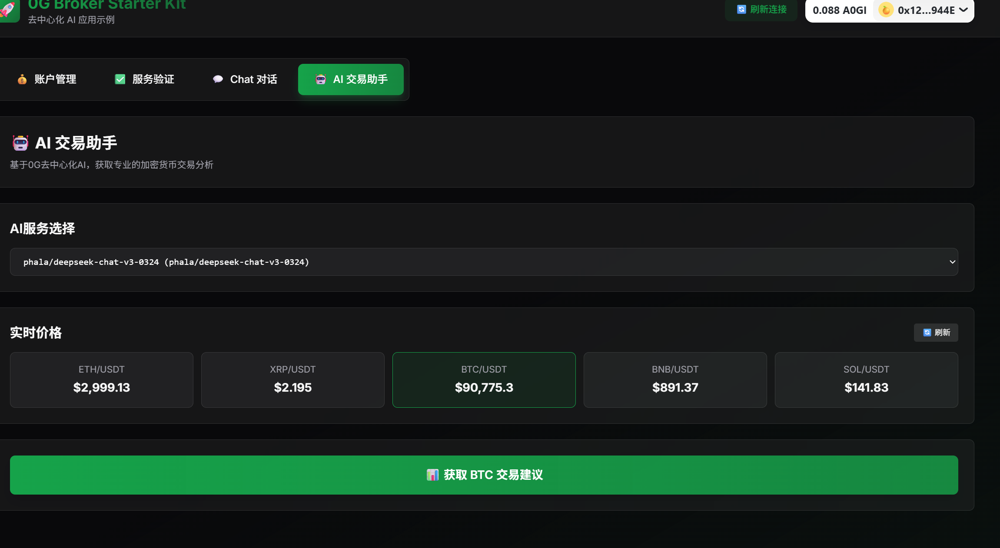
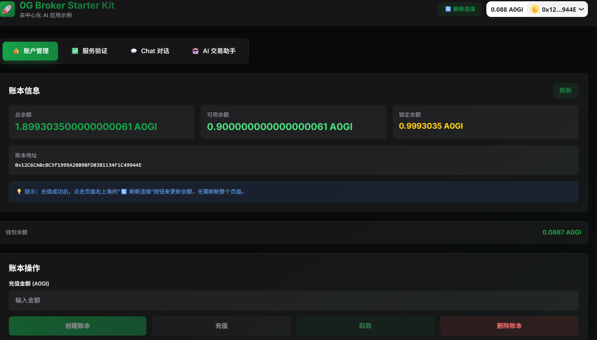
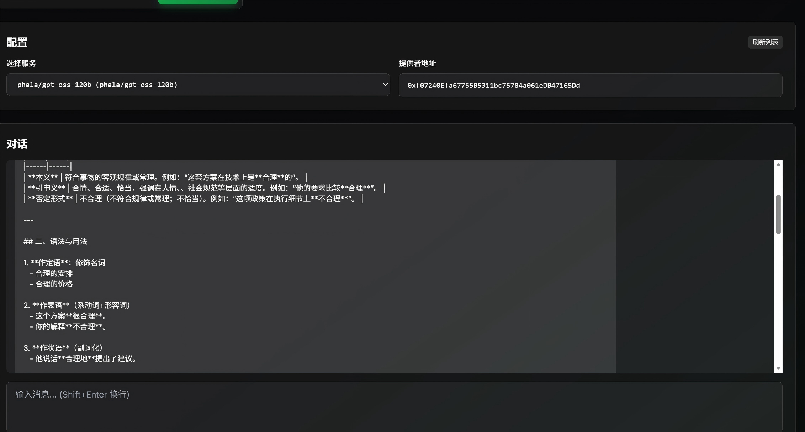
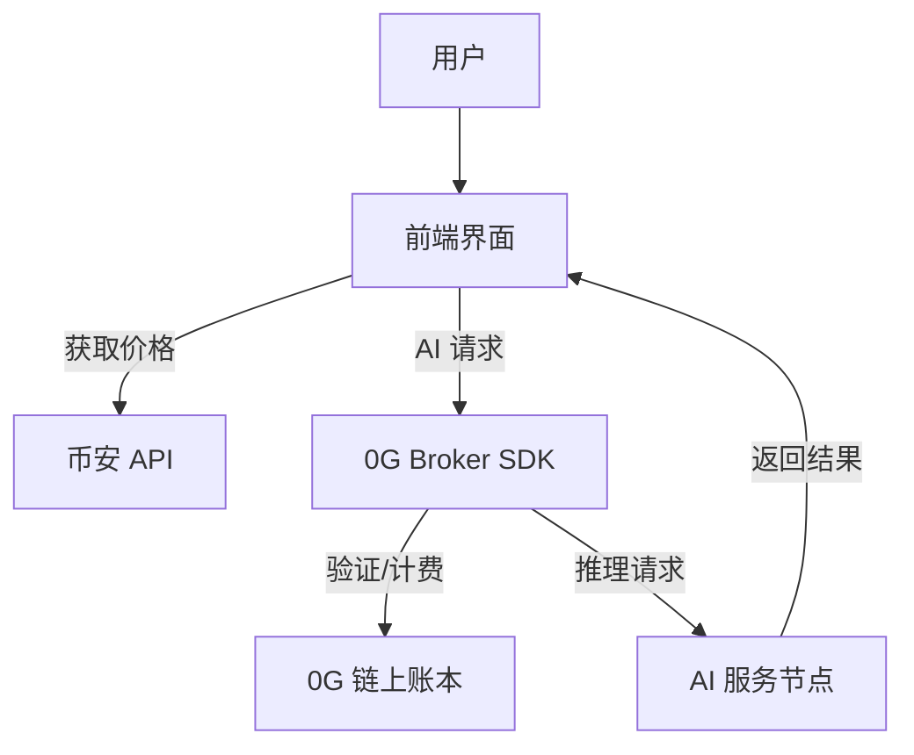

# 🤖 0G AI Trading Bot

> 基于 0G Compute Network 构建的去中心化 AI 交易助手

[](https://0g.ai)

## 📖 项目简介

**0G AI Trading Bot** 是一个展示去中心化 AI (Decentralized AI) 潜力的开源项目。它利用 **0G Serving Broker SDK** 连接到 0G 计算网络，结合 **币安期货 API** 的实时市场数据，为用户提供专业的加密货币交易分析和建议。

本项目不仅是一个交易工具，更是 0G 生态系统的完整演示，涵盖了账本管理、服务验证、子账户自动托管和可验证 AI 推理等核心功能。

## ✨ 核心功能

### 1. 🤖 AI 交易助手 (Trading Bot)
核心亮点功能。结合实时金融数据与去中心化 AI 分析：
- **实时行情**：集成币安期货 API，实时获取 BTC, ETH, BNB 等主流代币价格。
- **智能分析**：一键请求 AI 分析师对当前市场进行多维度解读（趋势、风险、关键点位）。
- **自动托管**：智能管理子账户资金，自动处理服务调用费用。

### 2. 💬 去中心化对话 (Chat)
与部署在 0G 网络上的多种 AI 模型进行自由对话：
- **多模型支持**：自由选择不同的 AI 服务提供商和模型。
- **隐私安全**：基于区块链的去中心化交互，无中心化审查。

### 3. 🔐 完整的账户体系
- **账本管理**：创建和管理链上账本，充值 A0GI 代币。
- **服务验证**：去中心化服务发现与验证机制，确保服务提供商真实可靠。
- **透明计费**：基于使用的精确计费，每一笔调用都可追溯。

## 📸 项目演示

### 交易助手界面

*实时价格监控与 AI 交易建议*

### 账户与服务管理

*账本余额管理与服务验证*

### 智能对话

*与去中心化 AI 模型进行交互*

## 🚀 快速开始

### 前置要求
- Node.js 18+
- MetaMask 钱包 (配置 0G 测试网)
- 少量 A0GI 测试代币

### 安装与运行

1. **克隆项目**
```bash
git clone https://github.com/your-username/0g-trading-bot.git
cd 0g-trading-bot
```

2. **安装依赖**
```bash
npm install
# 或
pnpm install
```

3. **启动开发服务器**
```bash
npm run dev
```

4. **访问应用**
打开浏览器访问 `http://localhost:3000`

## 💡 使用指南

### 第一步：连接与充值
1. 点击右上角连接钱包。
2. 进入 **"账户管理"** 页面。
3. 创建账本并充值 A0GI (建议至少 1 A0GI)。
4. 充值成功后，点击右上角 **"🔄 刷新连接"**。

### 第二步：验证服务
1. 进入 **"服务验证"** 页面。
2. 选择一个 AI 服务提供商。
3. 点击 **"验证服务"** 并确认签名。

### 第三步：使用交易助手
1. 进入 **"AI 交易助手"** 页面。
2. 选择已验证的 AI 服务。
3. 点击感兴趣的交易对 (如 BTC/USDT)。
4. 点击 **"获取交易建议"**。
   - *首次使用会自动创建子账户并转账 0.5 A0GI，需在钱包确认。*

## 🏗️ 技术架构



- **Frontend**: Next.js 14, TailwindCSS
- **SDK**: @0glabs/0g-serving-broker
- **Chain**: 0G Newton Testnet

## ⚠️ 免责声明

本项目提供的交易建议完全由 AI 生成，仅供参考，**不构成任何投资建议**。加密货币交易存在极高风险，请根据自身情况谨慎决策。开发者不对任何投资损失负责。

